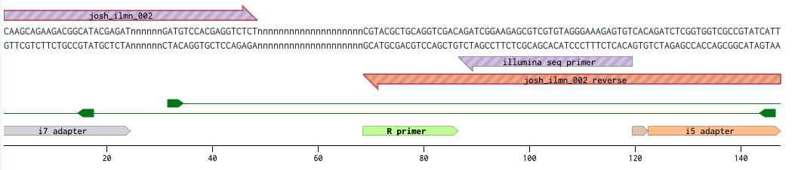

Analysis of barcode sequencing stress resistance experiment

```{r setup, include=FALSE}
knitr::opts_chunk$set(echo = TRUE)
require(kableExtra)

```
# Sequencing QC
* Sequencing [QC Data](inputs/seq_qc.html) from GeneWiz
* Read quality is high and uniform across the flow cell
* Good read count and base indexing

# Pre-processing




Unzip the data files, strip out metadata, truncate to barcodes, aggregate by frequency.

`gunzip -ckd ../../raw_data/00_fastq/barseq-001_R1_001.fastq.gz | wc | tee wc.log`
`$ 1739553016 2174441270 156826027621`
      >`1739553016 2174441270 156826027621`
The raw data file is 1.7B lines long
This means there are ~425M reads.


```{bash, eval=FALSE}
#!/bin/bash

##############################
### Pre-process BARSEQ data
##############################
#
# Josh McNamara, Johns Hopkins University, 2020
#
####################
### Description
#####################
#
# The script takes a fastq.gz compressed sequence as an input and outputs a tab separated (.tsv) file with the read count, experiment index, and gene barcode.
#
# Example:
# count 	index	barcode
# 23425234	CATGCT	GTATCGATTCGGATCTCGAT 
# 
# Output is delivered in a new directory titled 'output' in the current directory.
# For large files with redundancy, output file should be much smaller than input file
#
# The script takes ~1 hour to process a 30 Gb fastq.gz file on a 2016 4-core Lenovo Thinkcentre desktop with 8 Gb memory, outputting a ~100 Mb file
#
##############################


####################
### Inputs
####################

# Strip the gz suffix (last 3 char) from the input filename                                                                                                      
infile='../../raw_data/barseq-001_R1_001.fastq.gz'
hash='cd85574cdc0b41cb02f798421d3f09b4'

####################
### Setup
####################

# Initialize the timer
SECONDS=0

# Make output directory, -p if it does not already exist
mkdir -p output

# Name the output file
outfile='output/barseq_counts.tsv'
echo 'count	id	barcode' > $outfile

# Start a logfile
echo | tee $outfile.log # Write to terminal and create logfile
echo '====================' | tee -a $outfile.log # Write to terminal and append to logfile
echo 'BARSEQ pre-processing start' | tee -a $outfile.log 
echo '====================' | tee -a $outfile.log

# Check the integrity of the input file and write to logfile
echo  | tee -a $outfile.log
echo 'Checking input file integrity' |  tee -a $outfile.log
echo '----------' | tee -a $outfile.log
echo 'md5sum hash should equal:' | tee -a $outfile.log
echo $hash | tee -a $outfile.log
echo 'Input file hash is:' |  tee -a $outfile.log
infile_hash=$(md5 $infile) # Check the hash of the input file. The command is 'md5' on OSX, and should be replaced with 'md5sum' in a standard version of bash.
#infile_hash=$(head -n 1000000 $infile | md5 ) # Uncomment to only hash first 1M lines
echo $infile_hash | tee -a $outfile.log
echo Checking the hash took $SECONDS seconds. | tee -a $outfile.log
echo  | tee -a $outfile.log


####################
### Count the barcodes
####################
# This entire code block is a pipe to the output file
gunzip -ckd $infile | # Unzip the compressed raw data and send line-by-line to terminal. -c write to stdout, -k keep original file, -d decompress
#head -n 1000000 | # Uncomment this line to test the script on only the first 1M lines
agrep -3 '^GTCGACCTGCAGCGTACG' | # Select lines with the i7 sequence at the beginning of amplicon. agrep = approximate grep, -3 tolerate 3 mismatches, ^ = regex for beginning of line
cut -c19-86 | # Keep 19th-86th characters. This discards the primer sequence in the beginning and trims some sequence after the barcodes. Don't trim to the end of the barcodes yet because they have variable length
agrep -3 'ATCTCGTATGCCGTCTTCTGCTTG$' | # Search for the primer sequence 3' to the barcodes and tolerate 3 mismatches
rev | cut -c25- | rev |  # Reverse the line, discard the first 24 bases, and reverse the line back to discard the 3' primer sequence
grep AGAGACCTCGTGGACATC  | # Search lines for the forward primer sequence between the experiment index and the gene barcodes. We can only accept exact matches here because the next line replaces this sequence with a tab character
sed "s/AGAGACCTCGTGGACATC/\t/g" | # Replace the space between the barcodes 
tr ACGTacgt TGCAtgca | rev | # Take the reverse complement of the barcode sequences to put them in the same orientation as the library key
sort | # Sort the barcodes alphabetically so that identical reads are on adjacent lines
uniq -c | # Combine identical barcode reads, -c count how many copies of each and combine count and barcode into one line
grep -v ' 1 ' | # Only keep reads with 2 or more instances
sort -rn | # Sort the counted barcode reads by their frequency, -r descending order, -n sort by number
sed -e 's/^[ \t]*//' | # Get rid of leading whitespace that precedes the counts
tr ' ' '	' >> $outfile # Convert remaining spaces to a tab for .tsv format and write to output file specified above


####################
### Write missed reads to a file
####################
#gunzip -ckd $1  | grep @ -A 1 | grep -v @ | sed -n 'p;n'| cut -c1-86 | agrep -v3 '^ GTCGACCTGCAGCGTACG' |  cut -c 19- | agrep -3 'ATCTCGTATGCCGTCTTCTGCTTG$' | rev | cut -c25- | rev | grep AGAGACCTCGTGGACATC  | sed "s/AGAGACCTCGTGGACATC/\t/g" | tr ACGTacgt TGCAtgca | rev | sort| uniq -c | sort -rn > output/barseq.fastq.strip.trim.pare2.unq
# # Each phase
# n=1000000
# echo start
# gunzip -ckd $infile | head -n $n | wc

# echo first grep
# gunzip -ckd $infile | head -n $n | agrep -3 '^GTCGACCTGCAGCGTACG' | wc

# echo second grep
# gunzip -ckd $infile | head -n $n | agrep -3 '^GTCGACCTGCAGCGTACG' | cut -c19-86 | agrep -3 'ATCTCGTATGCCGTCTTCTGCTTG$' | wc

# echo third grep
# gunzip -ckd $infile | head -n $n | agrep -3 '^GTCGACCTGCAGCGTACG' | cut -c19-86 | agrep -3 'ATCTCGTATGCCGTCTTCTGCTTG$' | rev | cut -c25- | rev | agrep -2 AGAGACCTCGTGGACATC  | wc


# echo final
# gunzip -ckd $infile | head -n $n | agrep -3 '^GTCGACCTGCAGCGTACG' | cut -c19-86 | agrep -3 'ATCTCGTATGCCGTCTTCTGCTTG$' | rev | cut -c25- | rev | grep AGAGACCTCGTGGACATC  | sed "s/AGAGACCTCGTGGACATC/\t/g" | tr ACGTacgt TGCAtgca | rev | sort | wc

####################
### Finish the logfile
####################
echo | tee -a $outfile.log
echo File pre-processing took $SECONDS seconds. | tee -a $outfile.log
echo | tee -a $outfile.log
```
```
====================
BARSEQ pre-processing start
====================

Checking input file integrity
----------
md5sum hash should equal:
cd85574cdc0b41cb02f798421d3f09b4
Input file hash is:
cd85574cdc0b41cb02f798421d3f09b4 ../../raw_data/00_fastq/barseq-001_R1_001.fastq.gz
Checking the hash took 104 seconds.


File pre-processing took 3373 seconds.
```
```
count	id	barcode
1714877	ACCAT	GCGACGGCAGTTACCTTAATC
1532156	GTTGC	GCGACGGCAGTTACCTTAATC
1121474	TAATG	GCGACGGCAGTTACCTTAATC
485818	CTAATG	GAAGAGCATGTCGAACACCC
380914	CTAATG	CCGAGTAGCCAAGAGCATGA
336310	AACCAT	CATAGCTCTACAGACTTACG
316421	CTAATG	CATAGCTCTACAGACTTACG
305596	GGTTGC	CATAGCTCTACAGACTTACG
263527	AACCAT	GAAGAGCATGTCGAACACCC
```
# Barcode and index assignment

## Set up workspace
All of the input files should be in a directory below this script titled inputs, except for the barcode count data (output from shell script), which should be above in the preprocessing directory. 

This script caches data in the cached_intermediates directory so that later parts of the analysis can be run independently of the earlier ones.

All other outputs should be written to the outputs subdirectory.

The input file barcode_counts.tsv is a tab-separated frequency table extracted from the raw reads. It contains trimmed barcode sequences with more than 1 read.

```{r}
# Load the data
#read_counts <- read.csv(file = '../preprocessing/output/barseq_counts.tsv', header = TRUE)
read_counts <- read.table(file = '../preprocessing/output/manual.tsv', header = TRUE, col.names = c('count', 'index', 'barcode'), sep = '\t')

# Check the shape of the data frame
print('Data dimensions, rows x columns')
print(dim(read_counts))
head(read_counts)
```
## Read indexing
Each read has an in-line index that denotes its condition and replicate ID.
### Barcode index quality check

```{r}
# Sum all of the reads
read_sum <- sum(read_counts$count)
print('Total reads count')
print(read_sum)

# Sum read counts for each index
index_sums <- aggregate(read_counts$count, by=list(index=read_counts$index), FUN=sum)
colnames(index_sums)[2] <- 'count'
index_sums$fraction <- index_sums$count/read_sum
index_sums <- index_sums[order(index_sums$count, decreasing = TRUE),]
print('Total experiment indices')
print(dim(index_sums)[1])
print('Sum per experiment index')
head(index_sums, n = 20)

# plot each index's count
forplot <- head(index_sums, n = 60)
plot(x = forplot$fraction, main = 'Index Read Counts', ylab = 'Read fraction')

# How many in top 18?
print('Proportion of reads in top 18 indices')
print(sum(index_sums$frequency[1:18]))

```
There should be 18 indices, yet there are thousands here. 18 indices account for a majority of reads. These the correct indices. We will ignore non-exact matches and discard ~23% of the data.

### Experiment index assignment
#### Expand the experiment ID key
```{r, eval=FALSE}
id_key <- read.csv('inputs/expt_id_key.csv')

# Expand key functions
expand_index_key <- function(data, key, distance) {
      new_key <- data.frame()
      for (i in 1:nrow(data)) { 
          match <- agrep(data[i,]$index, key$index, max.distance = distance)
          if (length(match)==1) {
              new_row <- key[match,]
              new_row$index <- data[i,]$index
              new_key <- rbind(new_key, new_row)
          }
      }
      return(new_key)
}

iterative_key_expand <- function(data, key) {
      new_key <- key
      for (i in 0){
            unmatched <- data[!data$index %in% new_key$index,]
            #print(nrow(new_key))
            #print(sum(data[data$index %in% new_key$index,]$count))
            #print(sum(data[data$index %in% new_key$index,]$count) / sum(data$count))
            new_key <- unique(rbind(new_key, expand_index_key(unmatched, key, i)))
      }
      #print(sum(data[data$index %in% new_key$index,]$count))
      #print(sum(data[data$index %in% new_key$index,]$count) / sum(data$count))      
      return(new_key)
}

# Determine how much to expand the key
sample_sizes <- c(10, 50, 100, 500, 1000, 2000, 5000, 10000)
fraction_assigned <- numeric()
for (i in 1:length(sample_sizes)){
      expanded_id_key <- iterative_key_expand(head(incompletes, n=sample_sizes[i]), id_key)
      #print('within')
      #print(sum(fixing_ids[fixing_ids$index %in% expanded_id_key$index,]$count) / sum(fixing_ids$count))
      #print('set')
      fraction_assigned[i] <- sum(incompletes[incompletes$index %in% expanded_id_key$index,]$count) / sum(incompletes$count)
}
plot(x=sample_sizes, y=fraction_assigned)      

# The key maxes out around 3000
# Generate the new
incompletes <- incompletes[order(incompletes$count, decreasing = TRUE),]
fixing_ids <- head(incompletes, n=2000)
expanded_id_key <- iterative_key_expand(fixing_ids, id_key)


print('How many in the assignment set fit the new key?')
sum(fixing_ids[fixing_ids$index %in% expanded_id_key$index,]$count)      
sum(fixing_ids[fixing_ids$index %in% expanded_id_key$index,]$count) / sum(fixing_ids$count)
print('How many in the whole unassigned set fit the new key?')
sum(incompletes[incompletes$index %in% expanded_id_key$index,]$count)
sum(incompletes[incompletes$index %in% expanded_id_key$index,]$count) / sum(incompletes$count)

```

```{r}
id_key <- read.csv('inputs/expt_id_key.csv')
head(id_key)
indexed <- merge(x = read_counts, y = id_key, by = 'index', sort = FALSE, all.x = TRUE, all.y = TRUE)
failed_indexing <- indexed[!complete.cases(indexed),]
#indexed <- indexed[complete.cases(indexed),]
print('Fraction of total reads retained in assignment')
indexed_sum <- sum(indexed[complete.cases(indexed),]$count)
all_sum <- sum(indexed$count)
print(indexed_sum / read_sum)
print('Fraction of total reads retained for next step')
print(all_sum / read_sum)

```

## Barcode assignment
### Marge reads with barcode key
```{r} 
# Load keys
barcode_key <- read.csv('inputs/barcode_key.csv')
# Assign barcode keys
assigned_barcodes <- merge(x = indexed, y = barcode_key, by = 'barcode', sort = TRUE, all.x = TRUE, all.y = TRUE)
 
# Write 0 to key elements with no matches
assigned_barcodes[is.na(assigned_barcodes$count),]$count <- 0

# Collect incomplete cases
incompletes <- assigned_barcodes[!complete.cases(assigned_barcodes),]

# Get rid of incomplete cases
assigned_barcodes <- assigned_barcodes[complete.cases(assigned_barcodes),]

# How many reads were lost?
assigned_sum <- sum(assigned_barcodes$count)
print('Total reads retained')
print(assigned_sum)
print('Fraction of total reads')
print(assigned_sum / read_sum)
print('Fraction of indexed reads')
print(assigned_sum / indexed_sum)

# Remove second occurrence of every barcode in key to de-duplicate
unq_barcode_key <- barcode_key[!duplicated(barcode_key$barcode),]
# Assign de-duplicated keys
deduplicated <- merge(x = indexed, y = unq_barcode_key, by = 'barcode', sort = TRUE, all.x = TRUE, all.y = TRUE)
deduplicated_sum <- sum(deduplicated$count, na.rm = TRUE)
print('Total deduplicated reads retained')
print(deduplicated_sum)
print('Fraction deduplicated of total reads')
print(deduplicated_sum / read_sum)
print('Fraction deduplicated of indexed reads')
print(deduplicated_sum / indexed_sum)

no_reads <- incompletes[incompletes$count==0,]
no_barcode <- incompletes[incompletes$barcode=='',]
no_gene <- incompletes[is.na(incompletes$gene),]

print('Incomplete cases in assignment')
dim(incompletes)[1]
lengths <- c(dim(no_barcode)[1], dim(no_reads)[1], dim(no_gene)[1])
print('No barcode, no reads, no gene')
lengths
print('No reads + no gene match')
sum(lengths[2:3])

```
Notice that the fraction of reads _increased_ after the merge. This is because 74 of the barcodes in the key are used for two different genes. Deduplication gives the same number of reads as the indexed set. These genes can only be distinguished by their DOWNTAGs, which were not measured in this experiment. Thus, the counts will be applied to both possible genes and they can be disambiguated in follow-up experiments.

### Assign gene common names and descriptions
```{r} 
# Load gene descriptions and common names from SGD file. DONT EDIT IN EXCEL. It converts gene names to dates.
gene_descriptions <- read.csv('inputs/gene_descriptions.csv', stringsAsFactors = FALSE)
# Keep good columns
gene_descriptions <- gene_descriptions[,c(3,4,5)]
# Rename columns
colnames(gene_descriptions) <- c('gene', 'common', 'description')
# Get rid of blank rows
gene_descriptions <- gene_descriptions[!gene_descriptions$gene=='',]
# Make the common name of anything without a common name equal its systematic name
gene_descriptions[gene_descriptions$common=='',]$common <- gene_descriptions[gene_descriptions$common=='',]$gene
# Add the names to the dataframe
named_barcodes <- merge(assigned_barcodes, gene_descriptions, 'gene', all.x = TRUE, all.y = FALSE)
# Cache the dataframe
save(named_barcodes, file='outputs/named_barcodes.rdata')
head(named_barcodes)
```

### Barcode assignment QC
```{r, message=FALSE, warning=FALSE}
require(ggplot2)
require(ggthemes)
require(ggpubr)
require(RColorBrewer)
require(ggrepel)
theme_set(theme_pubr())
palette <- 'Set2'
# theme_few(), theme_hc(), theme_tufte(), theme_bw()

forplot <- aggregate(count~id+condition, named_barcodes,FUN=median)
ggplot(forplot, aes(x = id, y=count, fill=condition)) + ggtitle('Median reads per gene by experiment') + geom_bar(stat='identity') +xlab('Experiment ID') + scale_fill_brewer(palette = palette) + scale_color_brewer(palette = palette)

forplot <- aggregate(count~id+condition, named_barcodes,FUN=sum)
ggplot(forplot, aes(x = id, y=count, fill=condition)) + ggtitle('Total reads per experiment') + geom_bar(stat='identity') +xlab('Experiment ID') + scale_fill_brewer(palette = palette) + scale_color_brewer(palette = palette)

forplot <- aggregate(count~id+condition, named_barcodes,FUN=sd)
ggplot(forplot, aes(x = id, y=count, fill=condition)) + ggtitle('SD within experiment') + geom_bar(stat='identity') +xlab('Experiment ID') + ylab('SD') + scale_fill_brewer(palette = palette) + scale_color_brewer(palette = palette)

forplot <- aggregate(count~common+condition, named_barcodes,FUN=mean)
forplot <- forplot[order(forplot$count, decreasing = TRUE),]
plot <- ggplot(forplot, aes(x = common, y=count, color=condition)) + ggtitle('Mean between replicates by gene') + geom_point() +xlab('Gene') + ylab('Mean read count') + scale_fill_brewer(palette = palette) + scale_color_brewer(palette = palette) +theme(axis.text.x=element_blank(),
            axis.ticks.x=element_blank()) # + geom_text(aes(label=common), vjust=-1)
plot

forplot <- named_barcodes
forplot <- aggregate(count~common+condition, named_barcodes, FUN =mean)
forplot$sd <- aggregate(count~common+condition, named_barcodes, FUN =sd)$count
forplot$cv <- forplot$sd / forplot$count
forplot <- forplot[order(forplot$cv, decreasing = TRUE),]
plot <- ggplot(forplot, aes(x = common, y=cv, color=condition)) + ggtitle('Coefficient of variation replicates by gene') + geom_point() +xlab('Gene') + ylab('CV') + scale_fill_brewer(palette = palette) + scale_color_brewer(palette = palette) + theme(axis.text.x=element_blank(),
            axis.ticks.x=element_blank())# + geom_text(aes(label=common), vjust=-1)
plot

forplot <- aggregate(count~common+condition, named_barcodes,FUN=sd)
plot <- ggplot(forplot,
      aes(x = common, y=count, fill=condition, color=condition)) +
      ggtitle('SD between replicates by gene') +
      geom_point() +
      #ylab('SD') +
      #scale_fill_brewer(palette = palette) +
      #scale_color_brewer(palette = palette) +
      #theme(axis.text.x=element_blank(), axis.ticks.x=element_blank()) +
      geom_text_repel(fontface = 'bold',
                data=subset(forplot, count > 3e4),
                aes(x=common, y=count, label=common),
                force = 20)
plot

```

### Were any of the barcodes left out of the experiment?
Analysis forthcoming. ~800 estimated. Many are not in library or do not have UPTAGs.
```{r} 
# Need to do a left/ right join of data vs key , or merged date vs key to determine
# Can pull it out as incomplete cases after joining, probably.

```

### Is there bias by plate position in MoBY library?
```{r} 
# Order by plate and well name
ordered <- assigned_barcodes
ordered$plate <- paste(assigned_barcodes$plate, assigned_barcodes$well)
head(ordered)
tail(ordered)
ggplot(ordered, aes(x=plate, y=count, color=condition)) +
      geom_point() +
      ylab('Reads') + 
      xlab('Genes, ordered by plate position') +
      theme(legend.position = "right") +
      ggtitle('Reads per gene by plate position')
      
```
There does not appear to be a trend here.


# Statistics

## Assess differential abundance with a binomial exact test
Differential expression analysis in RNA seq is generally done as a binomial exact test. Fitting the data to a [negative binomial distribution](https://en.wikipedia.org/wiki/Negative_binomial_distribution) accounts for the dispersion in the counting data rather than assuming a Gaussian, and is said to be well suited to biological replicate data. Dispersion is estimated for each count and then the differential expression is calculated as a binomial exact test between the experimental group and a defined control group.

One key caveat with barseq experiments is that the library sizes are not all the same, there is some variance, unlike internal controls in RNA seq experiments. Therefore, corrections for total count per library must be applied. That is why we did not use the standard RNA seq library DESeq2. It uses raw rather than normalized counts. We will double individual index read counts later and test for a difference in fold-change or p-value as a verification that this normalization was applied by the edgeR software package.

### Prepare the data matrix for the differential expression tests
```{r, message=FALSE, warning=FALSE}
# These analysis libraries require data in a data.matrix format, with rows as gene names, columns experiment conditions, and all data in the table as numeric. Can not have NAs for genes. These will be filtered out.
count_matrix <- assigned_barcodes
# Give each condition a unique ID by condition and replicate

# Drop metadata columns
count_matrix <- count_matrix[,c(3,4,7)]

# Convert to wide format with each experiment count as a column
count_matrix <- reshape(data = count_matrix, idvar = 'gene', direction = 'wide', timevar='id')

# Name rows as genes and remove gene name column
rownames(count_matrix) <- count_matrix[,1]
count_matrix <- count_matrix[,-1]

# Name columns as exp id numbers
colnames(count_matrix) <- as.numeric(gsub("count.", "", colnames(count_matrix)))

# Sort columns by experiment id
count_matrix <- count_matrix[ , order(as.numeric(names(count_matrix)))]

# Convert from class dataframe to class matrix
count_matrix <- data.matrix(count_matrix)

# Make a matrix with NAs
NA_matrix <- count_matrix[!complete.cases(count_matrix),]

# Remove NAs
count_matrix <- count_matrix[complete.cases(count_matrix),]

# Cache the matrix
save(count_matrix, file='outputs/count_matrix.rdata')
head(count_matrix)
```

### Perform dispersion analysis and binomial exact tests

Experiment ID reference chart
1. YPD (control)
2. Oxidative stress
3. Osmotic stress (glycerol)
4. Freeze-thaw stress
5. mtDNA_t1
6. mtDNA_t2


```{r, message=FALSE, warning=FALSE}
library(edgeR)

# Declare the sample replicate groups
group <- c(1,1,1,2,2,2,3,3,3,4,4,4,5,5,5,6,6,6)
samples <- colnames(count_matrix)

# Dispersion estimates (copied from reference publication)
count_matrix <- DGEList(counts = count_matrix, group = group, samples = samples,)
count_matrix = estimateCommonDisp(count_matrix)
count_matrix = estimateTagwiseDisp(count_matrix)

# Calculate differential expression for each experiment
# Note that some experiments do not use the 'control' group as a control
        # Oxidation result
        result = exactTest(count_matrix, pair=c(1, 2))
        ox <- result$table
        colnames(ox) <- paste('ox', colnames(ox), sep='_')
        
        # Osmotic stress table
        result = exactTest(count_matrix, pair=c(1, 3))
        os <- result$table
        colnames(os) <- paste('os', colnames(os), sep='_')
        
        # Freeze-thaw table, control is glycerol condition
        result = exactTest(count_matrix, pair=c(3, 4))
        fr <- result$table
        colnames(fr) <- paste('fr', colnames(fr), sep='_')
        
        # mtDNA_t1
        result = exactTest(count_matrix, pair=c(1, 5))
        m1 <- result$table
        colnames(m1) <- paste('m1', colnames(m1), sep='_')
        
        # mtDNA_t2
        result = exactTest(count_matrix, pair=c(5, 6))
        m2 <- result$table
        colnames(m2) <- paste('m2', colnames(m2), sep='_')

# Combine DE analysis results
differential_expression <- cbind(ox, os, fr, m1, m2)
head(differential_expression, n = 5)
save(differential_expression, file = 'outputs/differential_expression.rdata')
```

### Convert differential expression marix back to dataframe format for analysis
```{r}
library(reshape2)
library(tidyr)
library(ggplot2)
library(dplyr)
# Load differential expression data
load('outputs/differential_expression.rdata')
# Convert from matrix to data.frame. Note new name = de_results
de_results <- data.frame(differential_expression)
# Move rownames to a new column
de_results$gene <- rownames(de_results)
# Mellt the dataframe to a long format with variables indicating the value type
de_results <- melt(de_results, id=c('gene' ))
# Convert variable type to a string for parsing
de_results$variable <- as.character(de_results$variable)
# Split the value type into experiment condition and stat type, remove concatenated varaible
de_results$condition <- sapply(strsplit(de_results$variable, '_',), "[[", 1)
de_results$stat <- sapply(strsplit(de_results$variable, '_',), "[[", 2)
de_results <- de_results[,-2]
# Give each stat type its own column
de_results <- dcast(de_results, gene+condition~stat)
de_results <- merge(de_results, gene_descriptions, by = 'gene')
de_results[de_results$common == '',]$common <- de_results[de_results$common == '',]$gene
save(de_results, file='outputs/de_results.rdata')
head(de_results)
```

# Data analysis
## Volcano Plots
### All reads
```{r, message=FALSE, warning=FALSE}
library(ggplot2)
library(ggrepel)
library(ggthemes)
library(ggpubr)
theme_set(theme_pubr())

load('outputs/de_results.rdata')
pval_cutoff <- 0.05

# Main volcano plot
forplot <- de_results
plot <- ggplot(data = forplot, aes()) +
        geom_point(aes(x=logFC, y=-log(PValue), color=condition)) +
        geom_hline(yintercept=-log(pval_cutoff), color='red') + # Horizontal line for pval cutoff
        scale_colour_discrete("Condition", labels = c('Freeze-thaw', 'EtBr Treatment', 'rho0 growth', 'Osmotic stress', 'Oxidative stress')) +
        theme(legend.position = 'right') +
        theme(plot.title = element_text(hjust=0.5)) +
        xlab('log(Fold-chage)') +
        ylab('log(P-value)') +
        ggtitle('Differential Barcode Frequencies') +
        geom_text_repel(
                        fontface = 'bold',
                        data=subset(forplot,
                                abs(logFC) > 5  & PValue < pval_cutoff),
                        aes(x=logFC, y=-log(PValue),
                        label=common),
                        force = 20,
                        show.legend = FALSE)
plot
```

### Oxidative stress

```{r, message=FALSE, warning=FALSE}
forplot <- de_results[de_results$condition %in% c('ox'),]
plot <- ggplot(data = forplot, aes()) +
        geom_point(aes(x=logFC, y=-log(PValue)), color='blue') +
        geom_hline(yintercept=-log(pval_cutoff), color='red') + # Horizontal line for pval cutoff
        theme(plot.title = element_text(hjust=0.5)) +
                theme(legend.position = "none") +
        xlab('log(Fold-chage)') +
        ylab('log(P-value)') +
        ggtitle(label = 'Oxidative Stress Differential Barcode Frequencies') +
        geom_text_repel(
                fontface = 'bold',
                data=subset(forplot,
                        (abs(logFC) > log(2)  & PValue < pval_cutoff) | (PValue < 0.01)),
                aes(x=logFC, y=-log(PValue),
                label=common),
                force = 20,
                show.legend = FALSE)
plot
```

```{r, echo=FALSE}
# Make a hit table
forplot <- subset(forplot, PValue < pval_cutoff)
forplot <- forplot[order(forplot$logFC, decreasing = TRUE),]
kbl(forplot) %>%
  kable_paper(full_width = T, c("hover")) %>%
  scroll_box(height = "300px")
```

**Interesting genes:**

* NRK1
* RPS22A
* PMA1
* HTA2
* HHF2
* NPC2
* HCM1
* RPL30
* RAD55
* UBC7
* HCM1

### Osmotic stress
```{r, message=FALSE, warning=FALSE}
forplot <- de_results[de_results$condition %in% c('os'),]
plot <- ggplot(data = forplot, aes()) +
        geom_point(aes(x=logFC, y=-log(PValue)), color='blue') +
        geom_hline(yintercept=-log(pval_cutoff), color='red') + # Horizontal line for pval cutoff
        theme(plot.title = element_text(hjust=0.5)) +
                theme(legend.position = "none") +
        xlab('log(Fold-chage)') +
        ylab('log(P-value)') +
        #xlim(-1,1) +
        geom_text_repel(
                fontface = 'bold',
                data=subset(forplot,
                        (PValue < pval_cutoff)),
                aes(x=logFC, y=-log(PValue),
                label=common),
                force = 20,
                show.legend = FALSE) +
        ggtitle(label = 'Osmotic Stress Differential Barcode Frequencies')
      
plot
#plot + xlim(-1,1)
```

```{r, echo=FALSE}
# Make a hit table
forplot <- subset(forplot, PValue < pval_cutoff)
forplot <- forplot[order(forplot$logFC, decreasing = TRUE),]
kbl(forplot) %>%
  kable_paper(full_width = T, c("hover")) %>%
  scroll_box(height = "300px")
```


**Interesting genes:**

* UBC7
* PSY2
* YGK3


**Interesting but not significant:**

* MIC60
* AVL9
* MAS1
* ZIP1
* FIR1
* ATP22

### Freeze-thaw
```{r, message=FALSE, warning=FALSE}
forplot <- de_results[de_results$condition %in% c('fr'),]
pval_cutoff <- 0.1
plot <- ggplot(data = forplot, aes()) +
        geom_point(aes(x=logFC, y=-log(PValue)), color='blue') +
        geom_hline(yintercept=-log(pval_cutoff), color='red') + # Horizontal line for pval cutoff
        theme(plot.title = element_text(hjust=0.5)) +
                theme(legend.position = "none") +
        xlab('log(Fold-chage)') +
        ylab('log(P-value)') +
        ggtitle(label = 'Freeze-Thaw Differential Barcode Frequencies') +
        geom_text_repel(
                fontface = 'bold',
                data=subset(forplot,
                        PValue < 0.1),
                aes(x=logFC, y=-log(PValue),
                label=common),
                force = 20,
                show.legend = FALSE)
plot
```

```{r, echo=FALSE}
# Make a hit table
forplot <- subset(forplot, PValue < pval_cutoff)
forplot <- forplot[order(forplot$logFC, decreasing = TRUE),]
kbl(forplot) %>%
  kable_paper(full_width = T, c("hover")) %>%
  scroll_box(height = "300px")
```


**Interesting genes: **

* FRT2
* YCR090C
* GAC1
* OAR1
* PLC1
* YLR030W
* YLR125W
* ATG14

**Interesting but not significant: **

* NRK1
* HTB1
* GAS3
* SSE2


### Ethidium Bromide Treatment
```{r, message=FALSE, warning=FALSE}
pval_cutoff <- 0.01
forplot <- de_results[de_results$condition %in% c('m1'),]
plot <- ggplot(data = forplot, aes()) +
        geom_point(aes(x=logFC, y=-log(PValue)), color='blue') +
        geom_hline(yintercept=-log(pval_cutoff), color='red') + # Horizontal line for pval cutoff
        theme(plot.title = element_text(hjust=0.5)) +
        #theme(plot.subtitle  = element_text(hjust=0.5)) +
                theme(legend.position = "none") +
        xlab('log(Fold-chage)') +
        ylab('log(P-value)') +
        #xlim(-1,1) +
        ggtitle(label = 'Ethidium Bromide Treatment Differential Barcode Frequencies') +
        geom_text_repel(
                fontface = 'bold',
                data=subset(forplot,
                        (PValue < pval_cutoff & abs(logFC) > log(3)) | (-log(PValue) > 10)),
                aes(x=logFC, y=-log(PValue),
                label=common),
                force = 20,
                show.legend = FALSE)
plot
```

```{r, echo=FALSE}
# Make a hit table
forplot <- subset(forplot, PValue < pval_cutoff)
forplot <- forplot[order(forplot$logFC, decreasing = TRUE),]
kbl(forplot) %>%
  kable_paper(full_width = T, c("hover")) %>%
  scroll_box(height = "300px")
```


**Interesting genes:**

_Adaptive_

* EVRV46
* MCA1
* NOP6
* AIM10
* YNL058C
* TAH1
* NCG3

_Maladaptive_

* YLR125W
* HHT2


### Proliferation of cells lacking mtDNA (rho0)
```{r}
pval_cutoff <- 1e-60
forplot <- de_results[de_results$condition %in% c('m2'),]
plot <- ggplot(data = forplot, aes()) +
        geom_point(aes(x=logFC, y=-log(PValue)), color='blue') +
        geom_hline(yintercept=-log(0.05), color='red') + # Horizontal line for pval cutoff
        theme(plot.title = element_text(hjust=0.5)) +
        #theme(plot.subtitle  = element_text(hjust=0.5)) +
                theme(legend.position = "none") +
        xlab('log(Fold-chage)') +
        ylab('log(P-value)') +
        #xlim(-1,1) +
        ggtitle(label = 'Differential Barcode Frequencies \n Proliferation Lacking mtDNA') +
        geom_text_repel(
                fontface = 'bold',
                data=subset(forplot,
                        PValue < pval_cutoff | abs(logFC) > log(75)),
                aes(x=logFC, y=-log(PValue),
                label=common),
                force = 20,
                show.legend = FALSE)
plot
```

```{r, echo=FALSE}
# Make a hit table
forplot <- subset(forplot, PValue < pval_cutoff)
forplot <- forplot[order(forplot$logFC, decreasing = TRUE),]
kbl(forplot) %>%
  kable_paper(full_width = T, c("hover")) %>%
  scroll_box(height = "300px")
```


**Interesting genes:**

_Adaptive_

* MIA40
* PPZ1
* PBP1
* SSB1
* ICY1
* YCK1
* VTS1
* YCK3
* SLM4
* MNP1
* SOK2
* ESA1
* RPP1
* SUR1
* HHT2

_Maladaptive_

* MIR1
* YDL180W
* RHO5
* TIM17

### All non-mtDNA stresses 
```{r}
pval_cutoff <- 0.05
forplot <- de_results[de_results$condition %in% c('ox', 'os', 'fr'),]
plot <- ggplot(data = forplot, aes()) +
        geom_point(aes(x=logFC, y=-log(PValue), color=condition)) +
        geom_hline(yintercept=-log(pval_cutoff), color='red') + # Horizontal line for pval cutoff
        theme(plot.title = element_text(hjust=0.5)) +
        theme(legend.position = "right") +
        xlab('log(Fold-chage)') +
        ylab('log(P-value)') +
        scale_color_discrete("Condition", labels = c('Freeze-thaw', 'Osmotic stress', 'Oxidative stress')) +

        ggtitle(label = 'Differential Barcode Frequencies \n Proliferation Lacking mtDNA') +
        geom_text_repel(
                fontface = 'bold',
                data=subset(forplot,
                        (PValue < 1e-99 & abs(logFC) > log(200))),
                aes(x=logFC, y=-log(PValue),
                label=common),
                force = 20,
                show.legend = FALSE)
plot
```

```{r, echo=FALSE}
# Make a hit table
forplot <- subset(forplot, PValue < pval_cutoff)
forplot <- forplot[order(forplot$logFC, decreasing = TRUE),]
kbl(forplot) %>%
  kable_paper(full_width = T, c("hover")) %>%
  scroll_box(height = "300px")
```


## Hit calling
The 10 most adaptive significant (p < 0.05) genes from each condition will be scrutinized further.

```{r}
# Sort the results
de_results <- de_results[order(de_results$logFC, decreasing = TRUE),]

# Subset hits
hits <- subset(de_results, (condition %in% c('os', 'ox', 'fr') & abs(logFC) > 1 & PValue < 0.05) | (condition == 'm1' & PValue < 0.001 & abs(logFC) > 1 ) | (condition == 'm2' & PValue < 1e-40 & abs(logFC) > 1) )

# Subset by p-value < 0.05
significant_results <- de_results[de_results$PValue < 0.05,]

# Subset the top 10 highest fold-changes of the significant results for each experiment
hits <- rbind(head(significant_results[significant_results$condition=='ox',],n = 10),
              head(significant_results[significant_results$condition=='os',],n = 10),
              head(significant_results[significant_results$condition=='fr',],n = 10),
              head(significant_results[significant_results$condition=='m1',],n = 10),
              head(significant_results[significant_results$condition=='m2',],n = 10))

# For some significant results the highest fold-change was negative. Subset positive fold-changes
hits <- hits[hits$logFC>0,]

# Are hits in different experiments redundant?
hit_freqs<- table(hits$common)
hit_freqs <- hit_freqs[order(hit_freqs, decreasing = TRUE)]
print('Are any hits in different experiments redundant?')
hit_freqs[1:4]
hits <- hits[hits$logFC>0,]
write.csv(hits, file='outputs/top_ten_hits_per_experiment.csv')

# How many significant measurements for each?
print('How many significant measurements for each condition?')
table(significant_results$condition)

# How many significantly deleterious alleles for each experiment?
print('How many significantly deleterious alleles for each condition?')
negative_significant <- significant_results[significant_results$logFC<0,]
table(negative_significant$condition)
```
### Hit table
```{r, echo=FALSE}
#knitr::kable(hits)
require(kableExtra)
kable_paper(kable(hits[,c(2,4,5,6,7)]), full_width = T, c("hover"))
```
Some experiments did not have 10 genes significantly enriched.


# To do

### Indexing
* Fix reads that did not match in `grep`
* Fix reads that failed indexing
      * Implement approximate matching
* Index length bias
* Any missing barcodes?
* Disambiguate duplicated UPTAGS
* Any high-frequency barcodes that are not in the library?
* Any pattern in the singletons?

### Analysis
- Read edgeR manual and check for misapplication

### Code
- Variable dictionary
- README.md file

# Scratch
* Add 1 or 10 to each read to avoid divide by 0
* What happens with drop-outs? 


## Unused commands / functions

```{r, eval=FALSE}
# Example subset by index
hits <- read_counts[read_counts$index=='GTGCCG',]
# Take means
means <- aggregate(count~common+condition, assigned_barcodes,FUN=mean)
colnames(means)[3] <- 'mean'
means$sd <- forplot <- aggregate(count~common+condition, assigned_barcodes,FUN=sd)$count
 
# Append control values to a new column for easy comparisons
controls <- means[means$condition == 'control',]
colnames(controls)[3] <- 'control_mean'
colnames(controls)[4] <- 'control_sd'
means <- merge(means, controls, by='common', all = TRUE)
means <- means[,-5]
colnames(means)[2] <- 'condition'
means$fold <- log2(means$mean / means$control_mean)
```

## Compile this notebook
```{r, eval=FALSE}
# This enables saving to the 'outputs' directory
rmarkdown::render('barseq_notebook.Rmd', output_file = 'outputs/barseq_notebook.html')
```


# Look at the raw counts of 14 validation hits
```{r}
val_hits <- c('FRT2', 'YCR090C', 'GAC1', 'PBP1', 'MIA40', 'PPZ1', 'SOK2', 'DSS1', 'MIC60', 'PSY2', 'HCM1', 'RAD55', 'PMA1', 'NRK1', 'SSB1', 'YCK3', 'YCK1', 'ICY1', 'ESA1', 'VTS1')
hit_reads <- named_barcodes[named_barcodes$common %in% val_hits,]

write.csv(file = '~/Desktop/hit_reads.csv', x = hit_reads)

barplot(x = named_barcodes[named_barcodes$common == 'YCR090C',]$count, y = named_barcodes[named_barcodes$common == 'YCR090C',]$condition)

a <- named_barcodes[named_barcodes$common == 'YCR090C',]
a <- a[complete.cases(a)]
barplot(a$count, xlab = a$condition)


```
```{r, eval = FALSE}


averaged <- aggregate(count ~ condition+gene, data = named_barcodes, FUN = 'mean')
averaged <- pivot_wider(data = averaged, names_from = condition, values_from = count)
a <- 
```